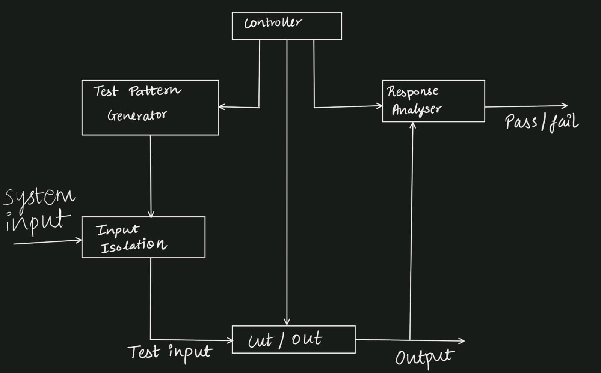
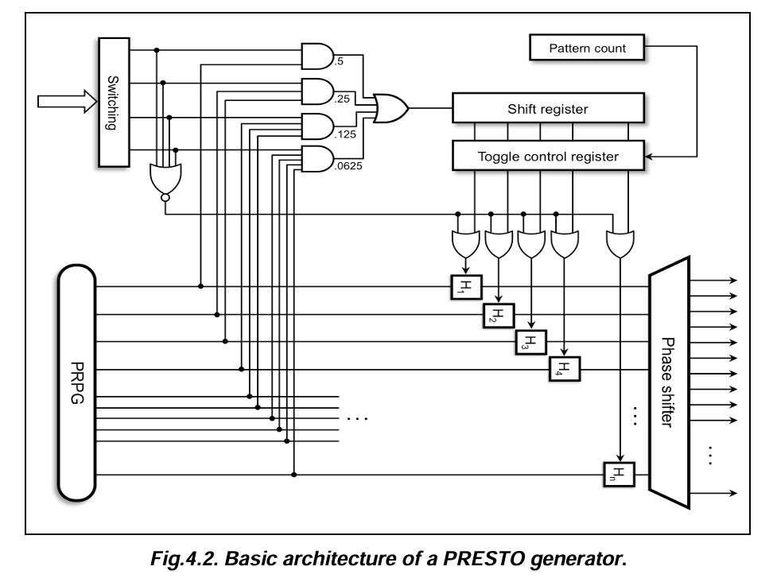
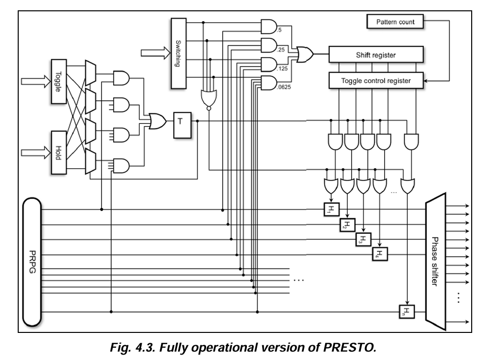
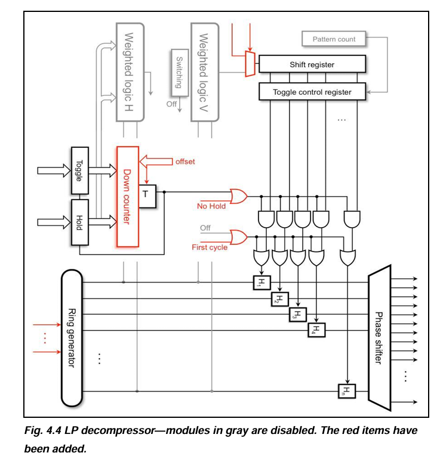

<div align="center">

# ⚡ PRESTO BIST Test Pattern Generator

**High-Performance Low-Power Pattern Generator for Built-In Self-Test**

[](https://en.wikipedia.org/wiki/Verilog)
[](https://digilent.com/shop/basys-3-artix-7-fpga-trainer-board/)
[](https://www.xilinx.com/products/design-tools/vivado.html)
[](https://www.xilinx.com/products/silicon-devices/fpga/artix-7.html)
[](LICENSE)

> 📄 Based on: *"High-Performance Pattern Test Generator for BIST"*
> Reshmi Nair & Nandini Maheshwari — Sathyabama Institute of Science and Technology, 2022

</div>

---

## 📌 Table of Contents

- [Overview](#-overview)
- [Why PRESTO?](#-why-presto-over-standard-lfsr-bist)
- [Architecture](#-architecture)
- [Module Descriptions](#-module-descriptions)
- [Simulation Results](#-simulation--results)
- [Repository Structure](#-repository-structure)
- [Test Scenarios](#-test-scenarios)
- [FPGA Pin Mapping](#-fpga-pin-mapping-basys3)
- [How to Run in Vivado](#-how-to-run-in-vivado)
- [Key Implementation Notes](#-key-implementation-notes)
- [Applications](#-applications)
- [Reference](#-reference)

---

## 🔍 Overview


*Fig. 1 — BIST system: Controller drives the Test Pattern Generator; patterns reach the CUT/DUT via Input Isolation; the Response Analyser outputs Pass/Fail.*

Modern chips are tested using **Built-In Self-Test (BIST)** — circuits embedded on the chip itself that generate test patterns, apply them to internal logic, and check responses — all without external test equipment.

The problem: standard BIST pattern generators switch **every signal on every clock cycle**, consuming far more power during testing than the chip ever would in normal operation. This causes overheating, voltage droops, and even permanent damage during production test.

**PRESTO** (Probabilistic Test Pattern Generator) solves this by intelligently controlling:
- **Which** scan chains receive new patterns each cycle
- **Which** are frozen (held)

Frozen chains draw **zero switching power**. The result: dramatically lower test power with **no loss in fault coverage**.

This implementation realises the complete PRESTO architecture in **synthesizable Verilog**, targeting the **Xilinx Basys3 FPGA (Artix-7)**. The switching activity level — from **6.25% up to 100%** — is controlled in real time via on-board slide switches.

---

## ⚖️ Why PRESTO over Standard LFSR BIST?

| Feature | Standard LFSR BIST | ⚡ PRESTO BIST |
|---|---|---|
| Switching activity | ~100% every cycle | **Configurable: 6.25% – 100%** |
| Test power | High — can exceed normal operating power | **Significantly reduced** |
| Fault coverage | Good | **Equivalent** (phase shifter maintains independence) |
| Flexibility | Fixed | **Programmable** hold/toggle durations |
| Real-time control | ❌ | ✅ Via slide switches on Basys3 |
| Hardware overhead | Minimal | Small (hold latches + weighted logic) |

---

## 🏗️ Architecture

### Basic PRESTO Architecture


*Fig. 4.2 — Basic PRESTO generator: PRPG (LFSR) feeds weighted AND-gate logic; toggle control register and hold latch array selectively freeze scan chain inputs; phase shifter decorrelates outputs.*

---

### Fully Operational PRESTO


*Fig. 4.3 — Full PRESTO: adds Toggle/Hold count inputs, a Down Counter, and a T flip-flop to automatically alternate between hold and toggle phases.*

The full version extends the basic architecture with:

| Addition | Role |
|---|---|
| **Toggle / Hold inputs** | Programs hold duration and toggle duration |
| **Down Counter** | Counts down the duration of each phase |
| **T Flip-Flop** | Alternates between hold phase and toggle phase at end of count |

---

### LP Decompressor Mode


*Fig. 4.4 — LP decompressor variant: gray modules are disabled; red additions (Down Counter, Ring Generator, offset, No Hold, First Cycle signals) enable compressed pattern delivery at further reduced power.*

---

### Signal Flow Summary

```
LFSR (PRPG) ──► Weighted Logic ──► Toggle Ctrl Reg ──► Hold Latch Array ──► Phase Shifter ──► Scan Chains
     │                                      ▲                                                       │
     └──► Shift Register (secondary LFSR) ──┘                                                       ▼
                                                                                         MISR (Response Analyser)
                                                                                                    │
T Flip-Flop ◄── Down Counter ◄── Mode MUX                                                          ▼
                                                                                              Pass / Fail
```

---

## 🧩 Module Descriptions

| # | Module | Purpose |
|---|--------|---------|
| 1 | `lfsr_8bit` | 8-bit Galois LFSR — generates pseudorandom test patterns (PRPG) |
| 2 | `weighted_logic` | AND-gate tree — produces enable signals at controlled probabilities (6.25% / 12.5% / 25% / 50%) |
| 3 | `toggle_ctrl_reg` | 8-bit register — decides which hold latches are in toggle vs. hold mode |
| 4 | `hold_latch_array` | Per-bit hold latches — freezes scan chain inputs to eliminate unnecessary transitions |
| 5 | `phase_shifter` | XOR tree — decorrelates latch outputs so scan chains receive statistically independent patterns |
| 6 | `t_flipflop` | Toggle flip-flop — alternates the generator between hold phase and toggle phase |
| 7 | `down_counter` | 4-bit down counter — controls the duration of each hold/toggle phase |
| 8 | `misr_8bit` | Multiple Input Signature Register — compresses CUT responses into an 8-bit signature for pass/fail |
| 9 | `presto_bist_top` | Top-level integration of all 8 modules above |

---

## 🧪 Simulation & Results

### Behavioural Simulation Waveform


*Vivado behavioural simulation — LFSR output, hold latch behaviour, phase shifter outputs, and MISR signature across all 5 test scenarios.*

---

### Elaborated RTL Schematic


*Elaborated RTL schematic from Vivado — all 9 modules and their interconnections visible: LFSR → Weighted Logic → Toggle Ctrl → Hold Latches → Phase Shifter → MISR.*

---

## 📁 Repository Structure

```
presto-bist-tpg/
├── src/
│   └── presto_bist_impl.v        # All 9 synthesizable hardware modules
├── sim/
│   └── tb_presto_bist.v          # 5-scenario self-checking testbench
├── constraints/
│   └── presto_bist.xdc           # Basys3 (Artix-7) pin and timing constraints
├── images/
│   ├── bist_overview.png         # BIST system block diagram
│   ├── architecture_presto.png   # Fig 4.2 — Basic PRESTO architecture
│   ├── fully_operational_presto.png  # Fig 4.3 — Full PRESTO
│   └── lp_decomposer.png         # Fig 4.4 — LP decompressor variant
├── results/
│   ├── simulation_waveform.png   # Vivado simulation screenshot
│   └── rtl_schematic.png         # Elaborated RTL schematic screenshot
└── README.md
```

---

## 🧾 Test Scenarios

The testbench exercises 5 operating modes covering the full switching activity range:

| Scenario | `switching_ip` | Switching Activity | Behaviour |
|----------|---------------|-------------------|-----------|
| LP OFF (Full) | `4'b0000` | **100%** | All hold latches transparent — maximum activity |
| 50% Toggle | `4'b1000` | **~50%** | Half of scan chains toggle per pattern |
| 25% Toggle | `4'b0100` | **~25%** | Matches the report's primary example |
| 12.5% Low Power | `4'b0010` | **~12.5%** | Very few transitions — minimal power draw |
| Hold/Toggle Phase | `4'b1100` | **~6.25%** | Phases alternate: stable for N cycles, then active for M cycles |

---

## 📌 FPGA Pin Mapping (Basys3)

| Verilog Port | Direction | Board Component | Pin(s) |
|---|---|---|---|
| `clk` | IN | 100 MHz Oscillator | W5 |
| `rst` | IN | Center Button | U18 |
| `switching_ip[3:0]` | IN | Slide Switches SW3–SW0 | W17, W16, V16, V17 |
| `hold_reg_in[3:0]` | IN | Slide Switches SW7–SW4 | W13, W14, V15, W15 |
| `toggle_reg_in[3:0]` | IN | Slide Switches SW11–SW8 | R3, T2, T3, V2 |
| `ckt_out[7:0]` | IN | Slide Switches SW15–SW8 | N3..W2 |
| `ph_shf_op[7:0]` | OUT | LEDs LD7–LD0 | V14..U16 |
| `z1` | OUT | LED LD8 | V13 |
| `z2` | OUT | LED LD9 | V3 |

---

## 🚀 How to Run in Vivado

### Step 1 — Simulation

1. Create a new Vivado project targeting `xc7a35tcpg236-1` (Basys3)
2. Add `src/presto_bist_impl.v` as a **Design Source**
3. Add `sim/tb_presto_bist.v` as a **Simulation Source**
4. Right-click `tb_presto_bist` → **Set as Top** (simulation only)
5. Run **Flow → Run Simulation → Run Behavioral Simulation**

### Step 2 — Synthesis & Implementation

1. Right-click `presto_bist_top` → **Set as Top**
2. Add `constraints/presto_bist.xdc` as a **Constraints file**
3. Run **Flow → Run Synthesis** → then **Flow → Run Implementation**
4. Generate bitstream and program the Basys3 board

> ⚠️ **Never synthesize the testbench file.** `$display` and `$finish` are simulation-only constructs and will cause synthesis errors.

---

## 🔑 Key Implementation Notes

| Note | Detail |
|---|---|
| **DONT_TOUCH attribute** | `(* DONT_TOUCH = "yes" *)` applied to `presto_bist_top` to prevent Vivado's `opt_design` from removing logic with unused outputs — fixes `[Place 30-494] Design is Empty` |
| **Hold latch coding** | Uses explicit per-bit `if` statements instead of a `for` loop — avoids implicit 32-bit loop variable (`i[31:0]`) appearing as `XXXXXXXX` in simulation |
| **MISR reset** | Explicitly initialized on reset to prevent X-propagation through XOR chains |
| **Timescale** | `timescale 1ns/1ps` declared once at top of design file — applies to all modules |

---

## 🌍 Applications

PRESTO BIST applies wherever test power is a concern — which in practice means almost every modern chip:

| Domain | Why PRESTO Matters |
|---|---|
| **Semiconductor Manufacturing** | Reduces IR-drop and false failures during high-speed production test |
| **Embedded Systems & IoT** | Allows self-test during idle periods without draining the battery |
| **Automotive (ISO 26262)** | Periodic self-test during vehicle operation without violating thermal budgets |
| **SoC Design** | Keeps power within delivery network limits across thousands of scan chains |
| **Academic & Research** | Complete working reference for low-power DFT, LFSR BIST, MISR compaction, FPGA prototyping |

---

## 📚 Reference

> R. Nair and N. Maheshwari, *"High-Performance Pattern Test Generator for BIST,"*
> Sathyabama Institute of Science and Technology, 2022.

---

<div align="center">

**⭐ If you found this project useful, please consider starring the repository!**

[](https://github.com/reshminairoff/presto-bist-tpg/stargazers)
[](https://github.com/reshminairoff/presto-bist-tpg/network/members)

*Made with ❤️ by [Reshmi Nair](https://github.com/reshminairoff)*

</div>
